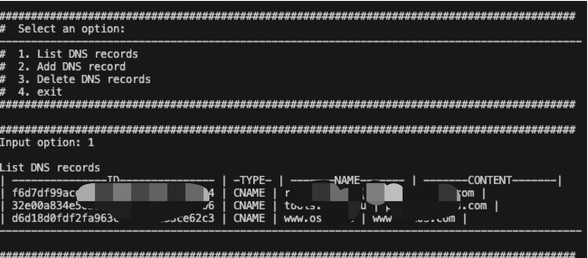

# cloudfira-dns-shell

I can't find a DNS records tools in the cloudflare. 
Just a small request to use cloudflare DNS, so I write a shell to use it.


## Getting started

### Run in linux or MacOS

zh
```
git clone https://github.com/panp1/cloudfira-dns-shell.git
cd cloudfira-dns-shell
chmod +x dnstools-zh.sh
export ZONE_ID="Your-Account-ZONE_ID"
export API_TOKEN="Your-API-TOKEN"
./dnstools-zh.sh
```


en
```
git clone https://github.com/panp1/cloudfira-dns-shell.git
cd cloudfira-dns-shell
chmod +x dnstools-en.sh
export ZONE_ID="Your-Account-ZONE_ID"
export API_TOKEN="Your-API-TOKEN"
./dnstools-en.sh
```



### Run in Docker

```
docker run -it --rm -e ZONE_ID="xxxxxxxxxxxxxxxxxx" -e API_TOKEN="xxxxxxxxxxxxx" registry.cn-hangzhou.aliyuncs.com/orcc/cd-dns-tools:zh
```

```
docker run -it --rm -e ZONE_ID="xxxxxxxxxxxxxxxxxx" -e API_TOKEN="xxxxxxxxxxxxx" registry.cn-hangzhou.aliyuncs.com/orcc/cd-dns-tools:cn
```


## Usage
-  DNS LIST
-  DNS ADD (A,CNAME,TXT)
-  DNS DELETE


## Note 
Not check the ipv4 is valid when add A record.
